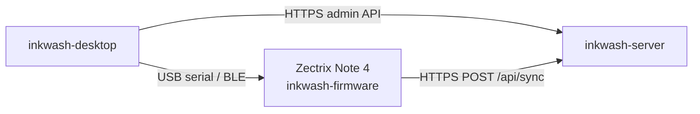

# Inkwash Desktop

PC configuration tool for the **Zectrix Note 4** e-ink device and the
[**Inkwash**](https://github.com/counhopig/inkwash-firmware) ecosystem.
A cross-platform (Linux / macOS / Windows) native app built with:

- **Tauri 2** — native window, system menus, file dialogs, notifications
- **Vue 3 + TypeScript** — the in-window UI (Composition API + Pinia)
- **Rust** — device transport (USB serial, BLE), server admin HTTP

[](LICENSE)
[](Cargo.toml)
[]()



It does **not** author content on the device. Four jobs:

- **Overview** — glanceable device + server state and setup progress.
- **Device** — push Wi-Fi credentials, sync server URL + device token,
  and timezone to the Note 4 over USB serial or BLE; trigger a sync; check
  status. Talks the protocol in the firmware repo's
  [`docs/control-protocol.md`](https://github.com/counhopig/inkwash-firmware/blob/main/docs/control-protocol.md).
- **Content** — register devices and manage their alarms/todos against
  `inkwash-server`'s admin API. This is where actual content gets
  authored; the device just pulls it later over Wi-Fi. Also manages
  **channels** (create webhook channels, copy the one-time delivery token,
  rotate it) and the device **inbox** (view/delete messages pushed from
  external sources).
- **Logs** — real-time diagnostics, mirrored to disk (see
  [Logging](#logging)).

## Repository layout

```text
inkwash-desktop/
├── src/                       # Rust (Tauri + transport + server client)
│   ├── main.rs                # CLI dispatch and Tauri launch
│   ├── desktop.rs             # Tauri builder + invoke_handler registration
│   ├── state.rs               # AppState + LinkState + Usb/Ble handles
│   ├── error.rs               # AppError + error-code catalog
│   ├── protocol.rs            # Wire types shared with the firmware
│   ├── server.rs              # HTTP client for inkwash-server
│   ├── transport/             # USB and BLE workers
│   └── commands/              # Tauri commands (one file per surface)
├── src-ui/                    # Vue 3 + TS + Pinia
│   ├── App.vue                # Root: shell + page routing
│   ├── pages/                 # OverviewPage, DevicePage, ContentPage, LogsPage
│   ├── components/            # AppShell, Sidebar, TopBar, Frame, Button, ...
│   ├── stores/                # Pinia: device, server, logs
│   ├── lib/                   # commands.ts (Tauri wrapper), types.ts, ...
│   └── styles/                # tokens.css + global/layout/components.css
├── icons/                     # Bundle icons
├── index.html                 # Vite entry
├── package.json               # Front-end deps + scripts
├── vite.config.ts             # Vite config
├── tsconfig.json              # TS config (strict)
├── tauri.conf.json            # Window + bundle config
├── Cargo.toml                 # Rust deps
└── build.rs                   # Tauri build script
```

## Develop

```bash
npm install
npm run tauri dev   # hot-reloads Vue, rebuilds Rust on change
```

## Front-end checks & Rust tests

```bash
npm run build   # vue-tsc --noEmit && vite build
cargo test      # wire format, URL normalisation, secret redaction,
                # request coalescing, and live-server integration tests
```

`.github/workflows/ci.yml` runs `cargo test` and `npm run build` on every
push/PR. The live-server integration tests (`cargo test -- --ignored`) are
skipped by default; point them at any reachable server with
`INKWASH_LIVE_URL=http://<host>:8080`.

## Release build

```bash
npm run tauri build
```

Produces a signed `.app` on macOS, MSIX/`.exe` on Windows, `.deb` /
`.AppImage` on Linux.

## CLI

The same binary runs headless for scripting — CLI args never launch the
Tauri window:

```bash
inkwash-desktop --ble-scan                        # true/false if a Note 4 advertises
inkwash-desktop --ble-list                        # full btleplug peripheral dump
inkwash-desktop --status /dev/cu.usbmodem1101     # USB status (default timeout 35s)
inkwash-desktop --sync   /dev/cu.usbmodem1101     # USB sync (default timeout 45s)
```

The ESP32-S3 USB Serial/JTAG port may reset the board on open, so
timeouts are deliberately generous.

## macOS permissions

First GUI run prompts for **Bluetooth** (needed for BLE; deny only
disables BLE — USB still works). USB serial generally needs no extra
permission.

## Design language

Both the Desktop and the Server UI are built to feel like the device's
own e-ink screen: paper-grey surfaces, ink-black rules, no saturated
accents; hierarchy carried by line weight and spacing; status conveyed
with glyphs (`○ ◉ △ ✓ ✕`). The system is encoded in
`src-ui/styles/tokens.css`.

## Logging

Logs go to a platform data directory (outside the project tree, so
`tauri dev`'s watcher doesn't loop):

| OS      | Directory                                |
| ------- | ---------------------------------------- |
| macOS   | `~/Library/Logs/inkwash-desktop/`       |
| Windows | `%LOCALAPPDATA%\inkwash-desktop\logs\`  |
| Linux   | `~/.local/share/inkwash-desktop/logs/`  |

Sensitive values (Wi-Fi passwords, admin/device tokens) are redacted on
disk; USB/BLE command names, replies and error codes are logged verbatim.

## License

[Apache-2.0](LICENSE).
